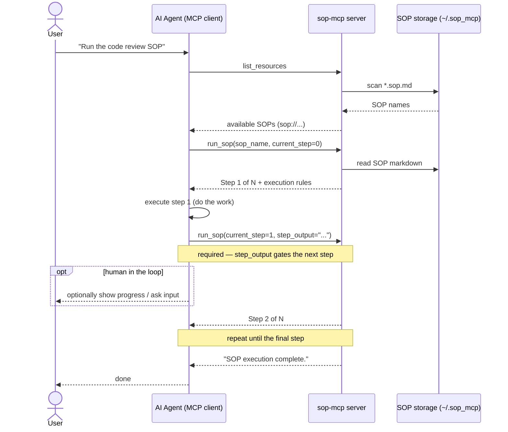

# sample-sop-mcp

[](https://github.com/aws-samples/sample-sop-mcp/actions/workflows/ci.yml) [](LICENSE)

> Turn your repeatable processes into Standard Operating Procedures (SOPs) that an AI agent executes one step at a time.

An MCP server that hands a procedure to your AI assistant one step at a time and asks it to produce concrete output before moving on. You talk to your agent in plain language — Kiro, Cursor, Claude Desktop, a Strands agent, or any MCP client — and it calls the SOP tools for you under the hood.

<p align="center">
  
</p>

## ✨ Features

- **🗣️ Plain-language driven** — Ask your agent to run or author an SOP; you never call tools by hand
- **👣 Step-at-a-time execution** — Each step must be executed and produce output before the agent advances
- **✅ Gated & auditable** — RFC 2119 levels (MUST, SHOULD, MAY) delivered one step at a time, each gated behind the previous, with progress kept explicit
- **📦 Batteries included** — Four ready-to-run SOPs seeded on first launch
- **✍️ Guided authoring** — A built-in guide interviews you, drafts, lints, and publishes new SOPs
- **🔌 Works everywhere** — One-click install for Kiro, Cursor, and VS Code; manual config for any MCP client

## 🤔 What's an SOP?

A Standard Operating Procedure is a markdown document that captures a repeatable, multi-step process — a code review, onboarding a new hire, cutting a release. LLMs are powerful but unpredictable across multi-step work: they skip steps, summarize instead of act, and lose their place. sop-mcp makes that behavior predictable — procedures arrive step by step, execution is gated, and progress is explicit.

## 🚀 Quick Start

### 1. Install

Add the server with one click, or paste the config below.

|                                                                                                                                          Kiro                                                                                                                                           |                                                                                                                                   Cursor                                                                                                                                   |                                                                                                                                                                                                   VS Code                                                                                                                                                                                                    |
| :-------------------------------------------------------------------------------------------------------------------------------------------------------------------------------------------------------------------------------------------------------------------------------------: | :------------------------------------------------------------------------------------------------------------------------------------------------------------------------------------------------------------------------------------------------------------------------: | :----------------------------------------------------------------------------------------------------------------------------------------------------------------------------------------------------------------------------------------------------------------------------------------------------------------------------------------------------------------------------------------------------------: |
| [](https://kiro.dev/launch/mcp/add?name=sop-mcp&config=%7B%22command%22%3A%20%22uvx%22%2C%20%22args%22%3A%20%5B%22--from%22%2C%20%22git%252Bhttps%3A%2F%2Fgithub.com%2Faws-samples%2Fsample-sop-mcp%22%2C%20%22sop-mcp%22%5D%7D) | [](https://cursor.com/en/install-mcp?name=sop-mcp&config=eyJjb21tYW5kIjogInV2eCIsICJhcmdzIjogWyItLWZyb20iLCAiZ2l0K2h0dHBzOi8vZ2l0aHViLmNvbS9hd3Mtc2FtcGxlcy9zYW1wbGUtc29wLW1jcCIsICJzb3AtbWNwIl19) | [](https://vscode.dev/redirect/mcp/install?name=sop-mcp&config=%7B%22type%22%3A%20%22stdio%22%2C%20%22command%22%3A%20%22uvx%22%2C%20%22args%22%3A%20%5B%22--from%22%2C%20%22git%2Bhttps%3A%2F%2Fgithub.com%2Faws-samples%2Fsample-sop-mcp%22%2C%20%22sop-mcp%22%5D%7D) |

```json
{
  "mcpServers": {
    "sop-mcp": {
      "command": "uvx",
      "args": ["--from", "git+https://github.com/aws-samples/sample-sop-mcp", "sop-mcp"]
    }
  }
}
```

`uvx` fetches and runs the server straight from this repo — no clone or build. On first run it seeds four [bundled SOPs](#-bundled-sops) into your storage directory. `SOP_STORAGE_DIR` is optional (see [Storage](#-storage)).

### 2. Verify the install

Restart your MCP client, then ask your agent to list the available SOPs:

> **You:** "List available SOPs."

You should see the bundled SOPs — `sop_creation_guide`, `code_review_process` and more. If none appear, check your MCP client's server logs for errors.

### 3. Run an SOP

Just ask your agent. It discovers the available SOPs, starts the one you named, and walks through it step by step — doing the work each step describes before advancing.

> **You:** "Run the code review SOP for my current branch."

You stay in the conversation: review each step's output, answer questions, or course-correct as it goes.

### 4. Author an SOP

Ask the agent to run the built-in authoring guide. It interviews you, drafts the SOP, validates it against the linter, and publishes it — all through conversation.

> **You:** "Help me write a new SOP for our release process — use the sop_creation_guide."
>
> **You:** "Looks good — publish it as preprod."

A clean lint means a clean publish, so your SOP is immediately runnable: *"Run my_release_process."*

## 🔄 How It Works



Each step tells the agent to *execute* — not just read. It must produce the step's expected output before advancing, which is what makes the run auditable. As the human in the loop, you see each step's result and can intervene at any point.

> **⚠️ Treat SOP content as untrusted.** sop-mcp serves SOP markdown to your agent verbatim — it can't tell a legitimate instruction from a malicious one. If your `SOP_STORAGE_DIR` is shared, synced, or holds SOPs you didn't author, review an SOP before running it: a crafted SOP could steer the agent into unintended actions (prompt injection). Keep a human in the loop for steps with real-world side effects.

## 🧩 Agent SOPs vs. Skills

The SOPs here use the [Agent SOP](https://github.com/strands-agents/agent-sop) format — portable markdown workflows (parameterized, with RFC 2119 `MUST`/`SHOULD`/`MAY` constraints) that guide an agent through a multi-step process. An [Agent Skill](https://agentskills.io) is *also* markdown that guides an agent, so the two look similar — the real difference is **how the instructions reach the agent**:

- **As a skill** — the whole playbook loads into context at once and the agent self-directs, so it can read ahead, skip, batch, or summarize. Great for domain knowledge and flexible tasks. (Agent SOPs can even be exported to the Skills format.)
- **Via sop-mcp** — the same SOP is metered out *one step at a time*. The agent sees only the current step and must report its output before the next is released. It can't look ahead or skip — which is what makes a multi-step run consistent and auditable.

|                   | As a Skill                       | Run via sop-mcp                                    |
| ----------------- | -------------------------------- | -------------------------------------------------- |
| Delivery          | whole playbook at once           | one step at a time                                 |
| Sequencing        | agent self-discipline            | gated — output required to advance                 |
| Progress state    | none                             | tracked and explicit                               |
| Look ahead / skip | possible                         | not possible                                       |
| Form              | static markdown file             | running server + tools (lint / publish / feedback) |
| Best for          | domain reference, flexible tasks | multi-step processes needing consistency & audit   |

(Separately, this repo also ships a regular skill — [`sop-mcp-usage`](skills/sop-mcp-usage/SKILL.md) — that teaches an agent *how* to drive the server.)

## 📦 Bundled SOPs

Four SOPs ship with the server — ask your agent to run any by name:

| SOP                         | What it does                                                                |
| --------------------------- | --------------------------------------------------------------------------- |
| `sop_creation_guide`        | Guided 7-step walkthrough for authoring new SOPs with RFC 2119 requirements |
| `code_review_process`       | Standard code review workflow — prepare, review, address feedback, merge    |
| `employee_onboarding_setup` | IT setup for a new hire — alias, email, hardware selection                  |
| `user_onboarding_process`   | Provision identity, application access, and welcome package                 |

## 🛠️ Tools

The agent calls these on your behalf — you won't invoke them directly.

| Tool                  | Purpose                                                                                |
| --------------------- | -------------------------------------------------------------------------------------- |
| `list_resources`      | Discover available SOPs (built in to every MCP client)                                 |
| `read_resource`       | Read an SOP's full content before executing it                                         |
| `run_sop`             | Execute an SOP step by step                                                            |
| `lint_sop`            | Validate a draft SOP against the same rules `publish_sop` enforces, without writing it |
| `publish_sop`         | Create or update an SOP                                                                |
| `submit_sop_feedback` | Record improvement suggestions                                                         |

Full parameter reference: [docs/mcp-reference.md](docs/mcp-reference.md)

## 💾 Storage

On first run the server seeds the bundled SOPs into your storage directory — `~/.sop_mcp` by default, or set `SOP_STORAGE_DIR` to point it elsewhere. Bundled SOPs are only copied when the directory has no SOPs yet, so anything you author is never overwritten.

To use a custom location, add a `SOP_STORAGE_DIR` env var to the server config:

```json
{
  "mcpServers": {
    "sop-mcp": {
      "command": "uvx",
      "args": ["--from", "git+https://github.com/aws-samples/sample-sop-mcp", "sop-mcp"],
      "env": { "SOP_STORAGE_DIR": "/path/to/your/sops" }
    }
  }
}
```

## 📚 Documentation

| Audience   | Resource                                                              |
| ---------- | --------------------------------------------------------------------- |
| AI tools   | [`llms.txt`](llms.txt) — auto-discovered server description           |
| Users      | [`skills/sop-mcp-usage/`](skills/sop-mcp-usage/SKILL.md) — how to use |
| Developers | [`CONTRIBUTING.md`](CONTRIBUTING.md) — build, test, design decisions  |
| Reference  | [`docs/mcp-reference.md`](docs/mcp-reference.md) — full tool schemas  |

## 💻 Development

```bash
uv sync                                  # install dependencies
uv run pytest                            # run tests
uv run ruff check src/ tests/            # lint
uv run sop-mcp                           # start server locally
uv run python scripts/generate_docs.py   # regenerate docs
```

## 🔐 Security

See [SECURITY.md](SECURITY.md) for the security policy, vulnerability reporting process, and security model documentation.

See [CONTRIBUTING](CONTRIBUTING.md#security-issue-notifications) for more information.

## License

This library is licensed under the MIT-0 License. See the LICENSE file.
